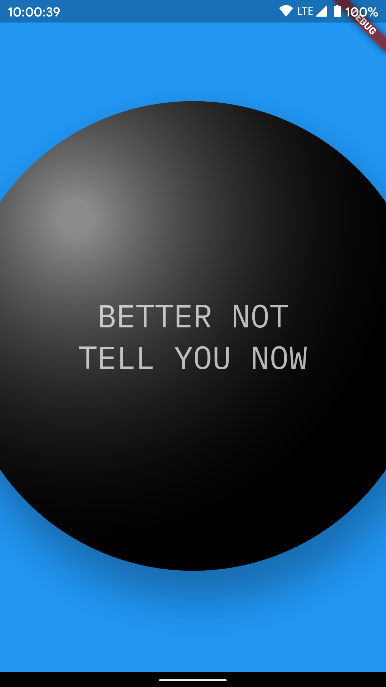

# Magic 8 ball demo

</img>

Demo for basic Flutter concepts, including:
- The [Dart](https://flutter.dev/docs/resources/bootstrap-into-dart) language
- [Theming](https://flutter.dev/docs/cookbook/design/themes)
- [Widgets](https://flutter.dev/docs/development/ui/widgets-intro)
- [Packages](https://flutter.dev/docs/development/packages-and-plugins/using-packages)
- [Network requests](https://flutter.dev/docs/cookbook/networking/fetch-data)
- Using Dart's [`json` package](https://dart.dev/guides/json) to decode API responses
